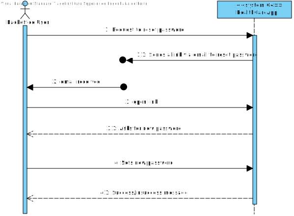

# US 5.1.2

## 1. Context

This task appears in the start of the project's development, to be able to reset a password of a existing user.


## 2. Requirements

**US 5.1.2** As a Backoffice User (Admin, Doctor, Nurse, Technician), I want to reset my password if I forget it, so that I can regain access to the system securely.

**Acceptance Criteria:**
- Backoffice users can request a password reset by providing their email.
- The system sends a password reset link via email.
- The reset link expires after a predefined period (e.g., 24 hours) for security.
- Users must provide a new password that meets the system’s password complexity rules.


**Dependencies/References:**


## 3. Analysis

For this US were considered the requirements specified in the project's description and the client's answers. 
Some relevant answers excerpts are here specified:


```
Q: 

A: 
```

The following **HTTP requests** will be implemented:
- POST (to reset the password of a existing user)
- PATCH (to update the user with the new password)


## 4. Design

This section presents the design adopted to solve the requirement.

### 4.1. Sequence Diagram (Level 1)

 


### 4.2. Sequence Diagram (Level 2)

 


### 4.3. Sequence Diagram (Level 3)

 

### 4.4. Applied Design Patterns

- **Domain Driven Development (DDD):** the focus is the business logic and not the implementation.
- **Data Transfer Object (DTO):** gives an abstraction layer to the domain, so that it's only presented specific information regarding the object.
- **Model View Controller (MVC):** allows the re-usability of components and promotes a more modular approach to the code, making it easier to manage and maintain.
- **Repository pattern:** allows access to data without sharing the details of data storing, like the database connection.
- **Service pattern:** helps keeping high cohesion and low coupling in the code by separating complex business logic from the rest of the system. They also promote reuse, as multiple parts of the system can use the same service to perform common operations.
- **Test Driven Development (TDD):** planning the tests previously to the code gives orientation lines to the development process.
- **Onion Architecture:** concentric layers structure that puts the Domin Model as the core. Promotes modularity, flexibility and testability.
- **Inversion of Control:** the responsability of object creation and dependency management belongs to a framework or external entity, so that the class doesn't need to. Promotes flexibility and decoupling.
- **Dependency Injection:** used to implement inversion of control. The dependencies are injected into a class from the outside.


### 4.5. Tests

#### 4.5.1. Unit and Integration Tests

- Unit tests for User entity reset password
- Unit tests for the controller focusing on the reset password of the user 
- Unit tests for the service focusing on the reset password of the user


#### 4.5.2. Postman Tests

- Status code test
- Response Body Contains fields
- Response Body data validation
- Check if the roles that can ask to reset password
- Check if Password was changed

## 5. Implementation

The implementation of this US is according to the design, as can be seen in the SD and CD presented before.

All commits referred the corresponding issue in GitHub, using the #3 tag, as well as a relevant commit message.

It was implemented in the branch feature/2-backend-user-reset-password.


## 6. Integration/Demonstration

To reset the password for a user, run the Backoffice app and send a POST HTTP request with the email.
Then a PATCH with the url received in the email, with the new password.

## 7. Observations

This work was guided by the project provided in ARQSI classes.