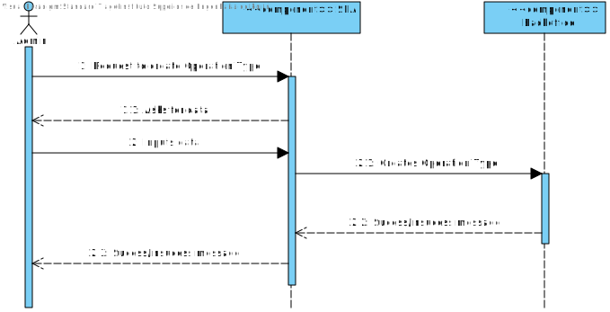
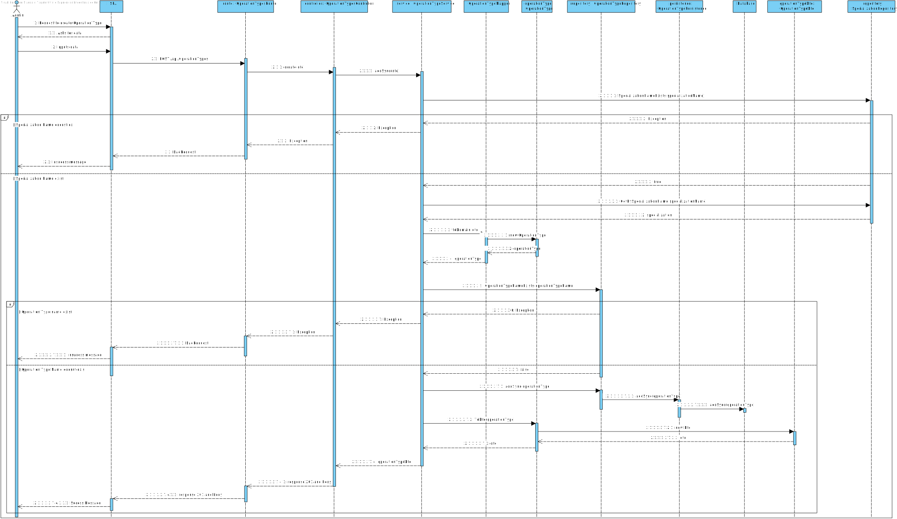

# US 5.1.20

## 1. Context

This task appears in the start of the project's development, to be able to create a new operation type.


## 2. Requirements

**US 5.1.20** As an Admin, I want to add new types of operations, so that I can reflect the available medical procedures in the system. 

**Acceptance Criteria:**

- Admins can add new operation types with attributes like: 
- Operation Name 
- Required Staff by Specialization 
- Estimated Duration 
- The system validates that the operation name is unique. 
- The system logs the creation of new operation types and makes them available for scheduling immediately. 


**Dependencies/References:**

It is also required that the user is registered and logged in as an admin.


## 3. Analysis

For this US were considered the requirements specified in the project's description and the client's answers. 
Some relevant answers excerpts are here specified:

```
Q: The document you provided divides surgical times into "specific phases of the surgery," whereas the main statement only mentions recording the total surgery time. Should the system, therefore, store and specify the time spent on each phase of the surgery, or is it sufficient to only record the total surgery time without detailing the time distribution across each phase?

A: when describing an operation type, the system must record the time for each phase
```

```
Q: Are the different phases of surgery relevant to the business and should they be recorded in the system?

A: yes. they are important due to the time it takes each phase and in the future for the planning of different teams (e.g., cleaning team)
```

```
Q: In the document with the surgeries, they all have 3 phases and respective duration:

-Anesthesia/patient preparation

-Surgery

-Cleaning

Can we assume while creating a new operation type, that the surgery must always have this 3 phases?

A: Yes
```


The following **HTTP requests** will be implemented:
- POST (to create a new operation type)
- GET (to check the new operation types)
- GET by ID (to find the new operation type)


## 4. Design

This section presents the design adopted to solve the requirement.

### 4.1. Sequence Diagram (Level 1)

 


### 4.2. Sequence Diagram (Level 2)

 


### 4.3. Sequence Diagram (Level 3)

 


### 4.4. Class Diagram

This diagram presents the classes that support the functionality.


### 4.5. Applied Design Patterns


### 4.6. Tests

#### 4.6.1. Unit Tests

- Null Duration
- Negative Duration
- Null required staff
- Negative total of staff with specialization
- Null total of staff with specialization


#### 4.6.2. Integration Tests

- Status code test
- Response time test
- Content-Type header test
- Response Body Contains ...
- Response Body data validation
- Status Code for Invalid Input
- Check if Resource Was Created
- Check for Duplicate Resource Creation
- Check if Data is Persisted


## 5. Implementation

The implementation of this US is according to the design, as can be seen in the SD and CD presented before.

All commits referred the corresponding issue in GitHub, using the #24 tag, as well as a relevant commit message.

It was implemented in the branch feature/20-backend-admin-add-new-operation-types.


## 6. Integration/Demonstration


## 7. Observations

This work was guided by the project provided in ARQSI classes.