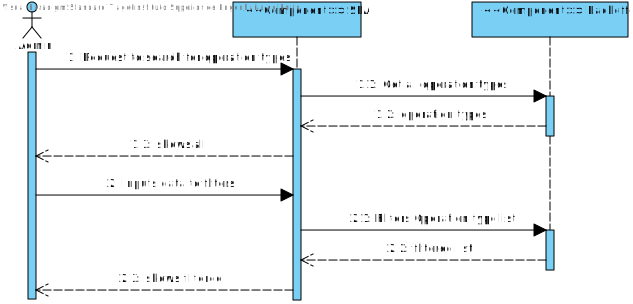
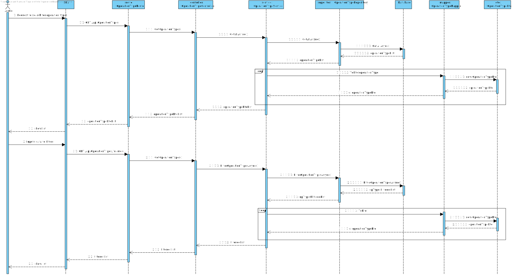

# US 5.1.23

## 1. Context

This task appears in the start of the project's development, to be able to list/search for operation types.


## 2. Requirements

**US 5.1.23** As an Admin, I want to list/search operation types, so that I can see the details, edit, and remove operation types.

**Acceptance Criteria:**
- Admins can search and filter operation types by name, specialization, or status (active/inactive).
- The system displays operation types in a searchable list with attributes such as name, required staff, and estimated duration.
- Admins can select an operation type to view, edit, or deactivate it.


**Dependencies/References:**

It is also required that the user is registered and logged in as an admin.


## 3. Analysis

For this US were considered the requirements specified in the project's description and the client's answers. 
Some relevant answers excerpts are here specified:


```
Q: 

A: 
```

```
Q: 

A: 
```

```
Q: 

A: 
```

```
Q: 

A: 
```

The following **HTTP requests** will be implemented:
- GET (to search for existing operation types)


## 4. Design

This section presents the design adopted to solve the requirement.

### 4.1. Sequence Diagram (Level 1)

 


### 4.2. Sequence Diagram (Level 2)

 


### 4.3. Sequence Diagram (Level 3)

 

### 4.4. Applied Design Patterns

- **Domain Driven Development (DDD):** the focus is the business logic and not the implementation.
- **Data Transfer Object (DTO):** gives an abstraction layer to the domain, so that it's only presented specific information regarding the object.
- **Model View Controller (MVC):** allows the re-usability of components and promotes a more modular approach to the code, making it easier to manage and maintain.
- **Repository pattern:** allows access to data without sharing the details of data storing, like the database connection.
- **Service pattern:** helps keeping high cohesion and low coupling in the code by separating complex business logic from the rest of the system. They also promote reuse, as multiple parts of the system can use the same service to perform common operations.
- **Test Driven Development (TDD):** planning the tests previously to the code gives orientation lines to the development process.
- **Onion Architecture:** concentric layers structure that puts the Domin Model as the core. Promotes modularity, flexibility and testability.
- **Inversion of Control:** the responsability of object creation and dependency management belongs to a framework or external entity, so that the class doesn't need to. Promotes flexibility and decoupling.
- **Dependency Injection:** used to implement inversion of control. The dependencies are injected into a class from the outside.


### 4.5. Tests

#### 4.5.1. Unit and Integration Tests

- Isolation and Integration tests for the controller
- Isolation and Integration tests for the service


#### 4.5.2. Postman Tests

- Status code test
- Response time test
- Response Body Contains
- Response Body data validation
- Status Code for Invalid Input


## 5. Implementation

The implementation of this US is according to the design, as can be seen in the SD and CD presented before.

All commits referred the corresponding issue in GitHub, using the #27 tag, as well as a relevant commit message.

It was implemented in the branch feature/22-backend-admin-.


## 6. Integration/Demonstration

To list/search for a Operation Type, run the Backoffice app and send a GET HTTP request with the filters.

## 7. Observations

This work was guided by the project provided in ARQSI classes.